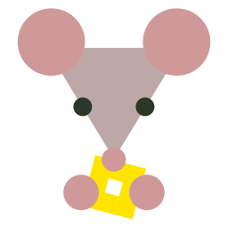

# Blox R.A.T. Proxy

A simple little API for me to test Vercel, and for you to get whatever basic info you need about someone via the Roblox API. Say "thanks" to Louie!

*<sub>R.A.T. stands for Roblox Avatar Thumbnail.</sub>*

 ## Image Example (Default)

[`https://bloxratp.vercel.app/api/avatar-thumbnail?userId=154248006&type=avatar-headshot&size=150&isCircular=false&responseType=image`](https://bloxratp.vercel.app/api/avatar-thumbnail?userId=154248006&type=avatar-headshot&size=150&isCircular=false&responseType=image)


 ## JSON Example

[`https://bloxratp.vercel.app/api/avatar-thumbnail?userId=154248006&type=avatar-headshot&size=150&isCircular=false&responseType=json`](https://bloxratp.vercel.app/api/avatar-thumbnail?userId=154248006&type=avatar-headshot&size=150&isCircular=false&responseType=json)

```json
{
  "userId": 154248006,
  "username": "kayos155",
  "isBanned": false,
  "profileInfo": {
    "created": "2016-08-20T13:07:17.787Z",
    "hasVerifiedBadge": false,
    "displayName": "KiCKTheBucket",
    "description": "chezburgr"
  },
  "avatarThumbnail": {
    "imageUrl": "https://tr.rbxcdn.com/30DAY-AvatarHeadshot-9D92EA3EB8F953FBDC822282AB21FB2B-Png/150/150/AvatarHeadshot/Png/noFilter",
    "type": "avatar-headshot",
    "size": "150",
    "isCircular": "false",
    "format": "Png"
  }
}
```

## Parameters

### `userId` (String):

The Roblox user's ID. This can be found in the profile's URL.

<i><span>https://www.roblox.com/users/<b>154248006</b>/profile</span></i>

---

### `type` (String):

Sets what type of avatar thumbnail is returned as the image.

Options: `avatar` (default), `avatar-bust`, `avatar-headshot`.

---

### `size` (Integer):

Sets what size the returned image is. To get a full list of supported sizes, make sure to check the official API docs, linked at the end. The options listed are sizes supported by all thumbnail types.

Options: `48`, `60`, `75`, `100`, `150`, `180` `420` (default)

---

### `isCircular` (Boolean):

Sets whether or not the returned image is circular.

Options: `true`, `false` (default)

---

### `format` (String):

Sets what file format the returned image is. `jpeg` format is not supported for `avatar-bust` thumbnails.

Options: `png` (default), `webp`, `jpeg`

---

### `responseType` (String):

Sets whether to return an image for thing such as `` elements, or JSON which includes the image URL as well as a bit more info about the user.

Options: `image` (default), `json`

---

For more detailed information on the different parameters and such, check out the official Roblox avatar thumbnail v1 docs:
https://create.roblox.com/docs/cloud/features/avatars#/default/get_v1_users_avatar